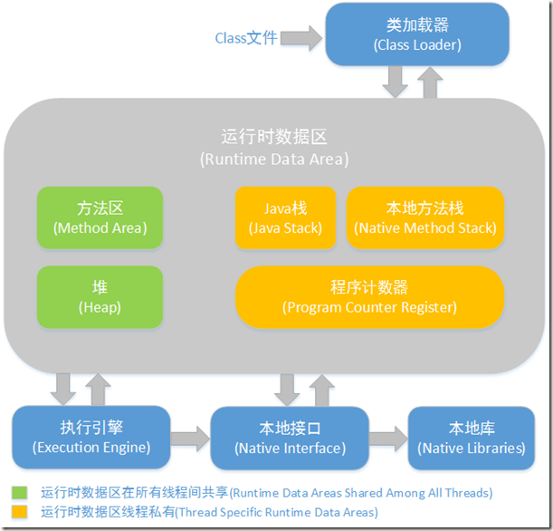

# 算法
  暂时用的力扣中国<br>
  1.**[反转链表](https://leetcode-cn.com/problems/reverse-linked-list/)**<br>
  ```
  class Solution {
      public ListNode reverseList(ListNode head) {
          ListNode pre = null;
          ListNode curr = head;
          while (curr != null) {
              ListNode temp = curr.next;
              curr.next = pre;
              pre = curr;
              curr = temp;
          }
          return pre;
      }
  }
  ```
  主要在于定义前后两个引用，需要通过画图来清晰自己的思维，开始的时候光凭想，便开始写
  代码，容易被弄晕。
  <br>
  <br>
  2.**[两数相加](https://leetcode-cn.com/problems/add-two-numbers/)**
   ``` 
   class Solution {
       public ListNode addTwoNumbers(ListNode l1, ListNode l2) {
           ListNode head = null;
           if (l1 == null && l2 == null) {
               return null;
           } else {
               ListNode curr1 = l1;
               ListNode curr2 = l2;
               ListNode curr = null;
               int carry = 0;
               while (curr1 != null || curr2 != null) {
                   int value1 = curr1 == null ? 0 : curr1.val;
                   int value2 = curr2 == null ? 0 : curr2.val;
                   int newValue = (value1 + value2 + carry) % 10;
                   carry = (value1 + value2 + carry) / 10;
                   ListNode listNode = new ListNode(newValue);
                   if (head == null) {
                       head = listNode;
                       curr = head;
                   } else {
                       curr.next = listNode;
                       curr = curr.next;
                   }
                   curr1 = curr1 == null ? null : curr1.next;
                   curr2 = curr2 == null ? null : curr2.next;
               }
               if (carry == 1) {
                   ListNode listNode = new ListNode(carry);
                   curr.next = listNode;
               }
           }
           return head;
       }
   }
   ```
   开始的时候，想得很复杂，可能是受反转链表的影响，竟然将两链表先去反转，然后走进了死胡同。该题主要
   考虑进位，处理好了进位就几乎完成了解答。看了下网上的答案，自己最后对进位为1则加到最高位的处理
   显得多余，应该放到while循环中，增加一个判断条件即可。
   <br>
   <br>
   3.**[环形链表](https://leetcode-cn.com/problems/linked-list-cycle/)**
   ```
   public class Solution {
       public boolean hasCycle(ListNode head) {
           ListNode curr = li;
           Set set = new HashSet();
           while (curr != null) {
               if (set.contains(li)) {
                   return true;
               }
               set.add(curr);
               curr = curr.next;
           }
           return false;
       }
   }
   ```
   这个是看了网上的解答，而后才恍然大悟。利用了set的特性。但还有用快慢指针的，只要
   两者相等的时候不等于null，是不是就可以得出判断了呢？
   <br>
   <br>
   4.**[合并两个有序链表](https://leetcode-cn.com/problems/merge-two-sorted-lists/)**
   ```
   class Solution {
       public ListNode mergeTwoLists(ListNode l1, ListNode l2) {
          ListNode se = new ListNode(-1);
          ListNode head = se;
          while (l1 != null || l2 != null) {
              int val = 0;
              if (l1 != null && l2 != null) {
                  if (l1.val < l2.val) {
                      val = l1.val;
                      l1 = l1.next;
                  } else {
                      val = l2.val;
                      l2 = l2.next;
                  }
              } else if (l1 == null && l2 != null) {
                  val = l2.val;
                  l2 = l2.next;
              } else {
                  val = l1.val;
                  l1 = l1.next;
              }
              ListNode newListNode = new ListNode(val);
              head.next = newListNode;
              head = head.next;
          }
          return se.next; 
       }
   }
   ```
   从这个算法开始，自己尝试开始用哨兵节点，慢慢体会它的妙出。
   <br>
   <br>
   5.**[删除链表的倒数第N个节点](https://leetcode-cn.com/problems/remove-nth-node-from-end-of-list/)**
   ```
   class Solution {
       public ListNode removeNthFromEnd(ListNode head, int n) {
           LinkedList<ListNode> list = new LinkedList();
           ListNode curr = head;
           while (curr != null) {
               list.add(curr);
               curr = curr.next;
           }
   
           if (list.size() == n) {
               curr = head.next;
               head.next = null;
               head = curr;
               return head;
           } else if (n == 1) {
               curr = list.get(list.size() - n - 1);
               curr.next = null;
           } else {
               ListNode removeNode = list.get(list.size() - n);
               curr = list.get(list.size() - n - 1);
               curr.next = removeNode.next;
               removeNode.next = null;
           }
           return list.getFirst();
       }
   }
   ```
   我的解答是想着链表环的检测可以用Java自带的工具包，那这个无非就是要找出相应的索引，
   所以就用了List,从题的解答来看，自己完全走错了方向，虽然答案是正确的。汗颜。。。
   <br>
   看了官方答案，比较好的做法是用快慢指针，中间间隔为N，实在是巧妙。
   <br>
   <br>
   6.**[链表的中间结点](https://leetcode-cn.com/problems/middle-of-the-linked-list/)**
   ```
   class Solution {
       public ListNode middleNode(ListNode head) {
           ListNode se = new ListNode(-1);
           se.next = head;
           ListNode curr = head;
           int size = 0;
           while (curr != null) {
               ++size;
               curr = curr.next;
           }
           for(int index = 0, length = size/2; index <= length; ++index){
               se = se.next;
           }
           return se;
       }
   }
   ```
   官方比较好的做法是用快慢指针，慢指针走一步，快指针走两步，思想甚是巧妙。
   <br>
   <br>
   
# 阅读点评
**[How to sort a Map by keys in Java 8 - Example Tutorial](https://javarevisited.blogspot.com/2017/07/how-to-sort-map-by-keys-in-java-8.html)**
<br>
<br>
**[How to Sort a HashMap by Values in Ascending and Descending Order in Java 8 - Example Tutorial](https://javarevisited.blogspot.com/2017/09/java-8-sorting-hashmap-by-values-in.html)**
<br>
两篇文章可以一起看，一篇是对Map按照key进行排序操作，一篇是对Map按照value进行排序操作。
<br>
1.借助Java8的Stream及Lambda特性;
<br>
2.使用Entry接口中comparingByKey()/comparingByValue()方法进行比较，得出正序结果（
如果想对一些特定的对象，依据特定的属性进行排序，实现这俩接口便可）。
<br>
3.离不开LinkedHashMap的配合（分为插入顺序与访问顺序，访问顺序一般涉及LUR算法使用），
此处利用其保持插入排序的特性
<br>
4.注意点：toMap方法中，第三个参数表示有俩相同值时的取舍方案，一般第四个参数默认为HashMap实现。
<br>
<br>
# 技术学习
最近的学习主要分为两部分，一部分是回头看，将之前看过的知识点进行重新梳理，因为自己的感知能力较低，
看过了并不代表真正懂了，能够运用于实际；另一部分是继续往前走，学习新的知识点。
<br>
记录一下最近重看虚拟机相关的知识点：
<br>
主要知识来源是周志明老师的《深入理解Java虚拟机》与郑雨迪老师的专栏。
之前一直对运行时数据区的理解不够深入，引入如下图
<br>


一定要区分为何方法区/堆是共享（和他们存入的数据类别有关，类文件中的常量池，一系列的常量，静态数据，
堆中的对象实例，GC时能够统一管理），虚拟机栈，本地方法栈，程序计数器为线程私有（我通常结合栈帧进行理解，实际的引用存放
在栈内，局部变量表只能是线程私有等等）。

另外，对类的初始化时调用<clinit>与对象初始化时调用<init>方法进行区分理解，都是只会调用一次，但调用时期
却不同，<clinit>的触发一般发生在以下几个时期：

- (首次)创建某个类的新实例时--new, 反射, 克隆 或 反序列化;
- (首次)调用某个类的静态方法时;
- (首次)使用某个类或接口的静态字段或对该字段(final 字段除外)赋值时;
- (首次)调用java的某些反射方法时;
- (首次)初始化某个类的子类时;
- (首次)在虚拟机启动时某个含有 main() 方法的那个启动类

可以看到，静态变量与静态代码块的初始化是发生在类的初始化时期，非静态变量的初始化则是在对象的初始化调用
<init>方法时发生。

后续有时间再接着总结下JVM内存模型，这也是自己知识模糊的点。。。
<br>

# 文章分享 
   分享一篇两年前看到的文章，当时对我的帮助挺大，让我对Spring的AOP有了深入的理解。
   
   **[AOP 那点事儿](https://my.oschina.net/huangyong/blog/161338)**
   
   **[AOP 那点事儿（续集）](https://my.oschina.net/huangyong/blog/161402)**